# Time Series Forecasting for Portfolio Management

**10 Academy – KAIM Week 9**

## Overview

End-to-end pipeline for time series forecasting and portfolio optimisation using **TSLA, BND, and SPY** data from YFinance (2015–2026). Five tasks, each on its own branch, with CI/CD running pytest on every PR.

## Project Structure
```
prod/
├── .github/workflows/unittests.yml  # CI: pytest on every PR
├── data/processed/                  # Cleaned CSVs + stats JSONs
├── notebooks/                       # Jupyter notebooks per task
│   └── images/                      # Saved plots for reports
├── src/                             # Reusable modules
├── tests/                           # Unit tests
└── scripts/                         # Utility scripts
```

## Tasks
| Task | Branch | Notebook | Description |
|------|--------|----------|-------------|
| 1 | `task/task-1` | `task1_eda.ipynb` | EDA, cleaning, stationarity, risk metrics |
| 2 | `task/task-2` | `task2_forecasting.ipynb` | ARIMA/SARIMA + LSTM models |
| 3 | `task/task-3` | `task3_future_forecast.ipynb` | Future forecasts with confidence intervals |
| 4 | `task/task-4` | `task4_portfolio_optimization.ipynb` | Efficient Frontier & portfolio optimisation |
| 5 | `task/task-5` | `task5_backtesting.ipynb` | Backtesting vs 60/40 benchmark |

---

## Task 1 – EDA & Risk Metrics (2015-01-01 → 2026-01-15)

Fetched and cleaned 2 775 trading days of TSLA, BND, and SPY data. Performed stationarity tests (ADF), computed risk metrics, and identified outliers.

### Stationarity (ADF test)
| Ticker | Close Price Stationary? | Daily Return Stationary? |
|--------|------------------------|--------------------------|
| TSLA | ❌ No (p = 0.825) | ✅ Yes (p < 0.001) |
| BND  | ❌ No (p = 0.734) | ✅ Yes (p < 0.001) |
| SPY  | ❌ No (p = 0.996) | ✅ Yes (p < 0.001) |

### Risk Metrics (annualised, full period)
| Ticker | Ann. Return | Ann. Volatility | Sharpe Ratio | VaR 95 % (daily) |
|--------|-------------|-----------------|--------------|------------------|
| TSLA | 47.5 % | 57.7 % | 0.754 | −5.25 % |
| BND  | 2.0 %  | 5.4 %  | −0.365 | −0.48 % |
| SPY  | 14.3 % | 17.8 % | 0.579 | −1.67 % |

### Plots

**Closing Prices**
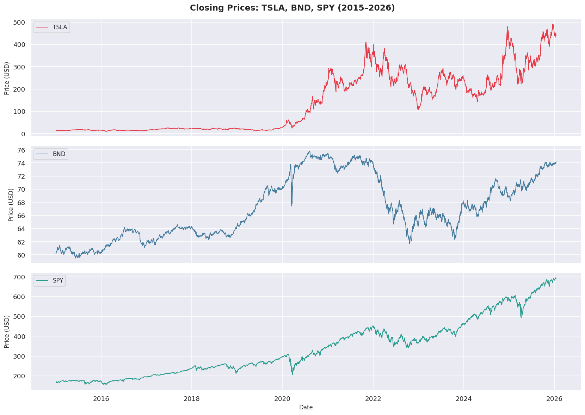

**Daily Returns**
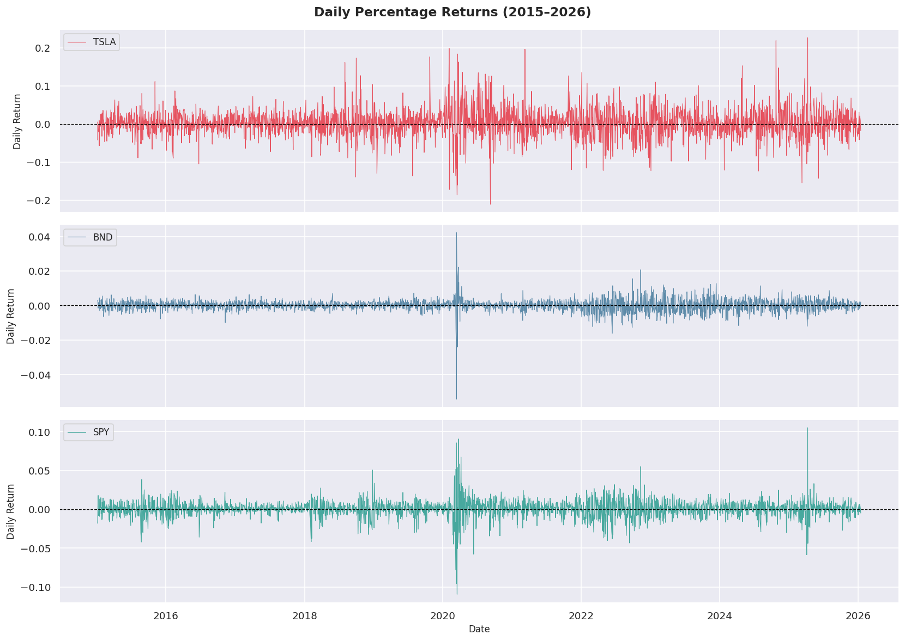

**TSLA Rolling Statistics**
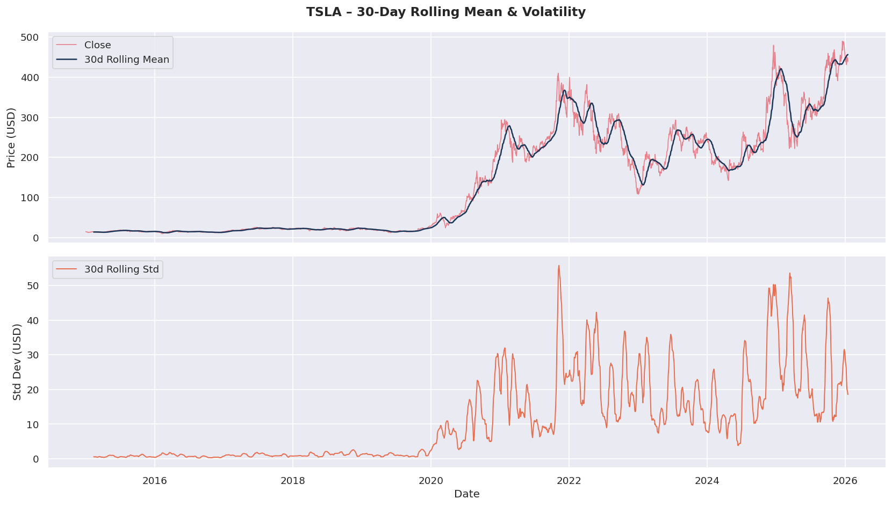

**Return Distributions**
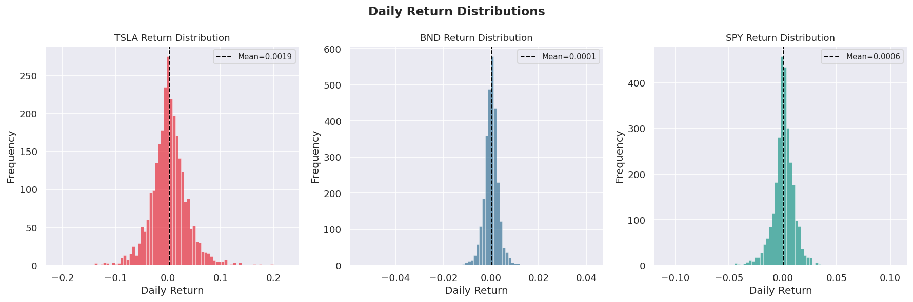

**Correlation Heatmap**
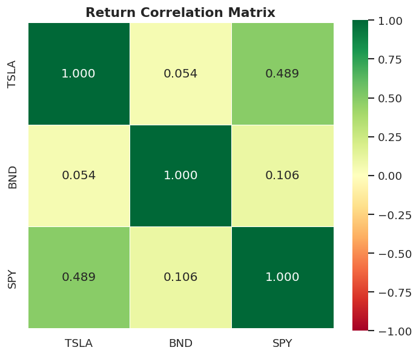

**TSLA Value at Risk**
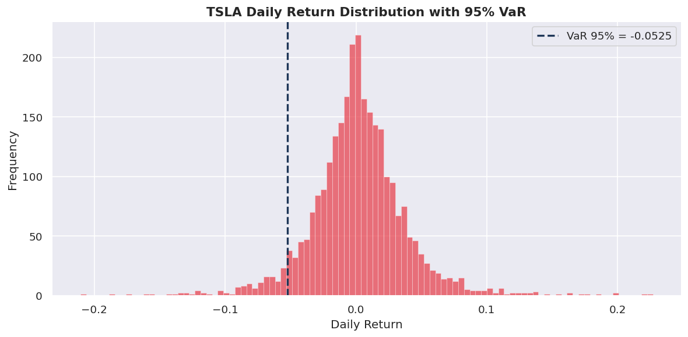

---

## Task 2 – Forecasting Models

Trained ARIMA and LSTM on TSLA close prices. Train: 2015–2024, Test: Jan 2025–Jan 2026.

### Model Comparison
| Model | MAE | RMSE | MAPE |
|-------|-----|------|------|
| ARIMA(0,1,0) | 71.13 | 90.28 | 23.83 % |
| **LSTM** | **12.96** | **16.41** | **3.76 %** |

**Winner: LSTM** — over 5× better RMSE than ARIMA.

### Plots

**Train / Test Split**
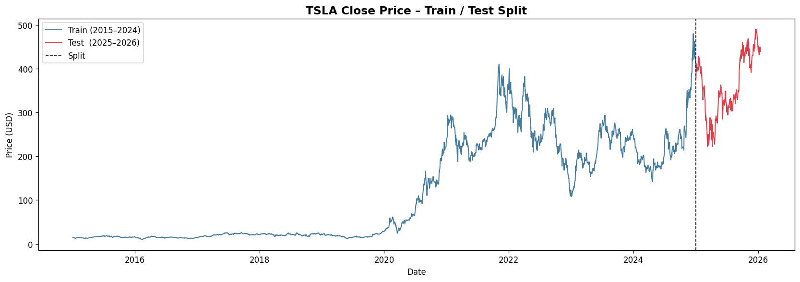

**ACF / PACF**
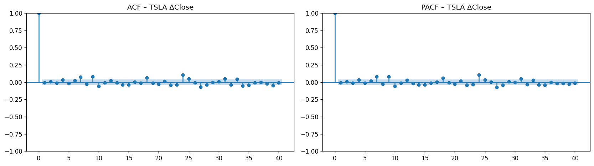

**ARIMA Forecast**
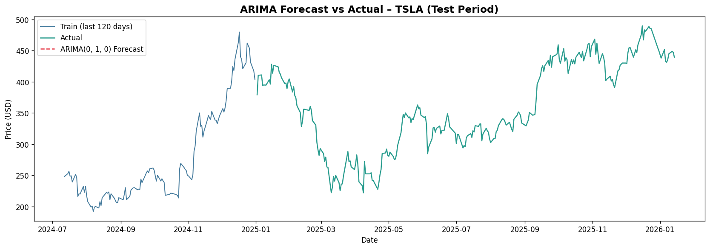

**LSTM Training Loss**
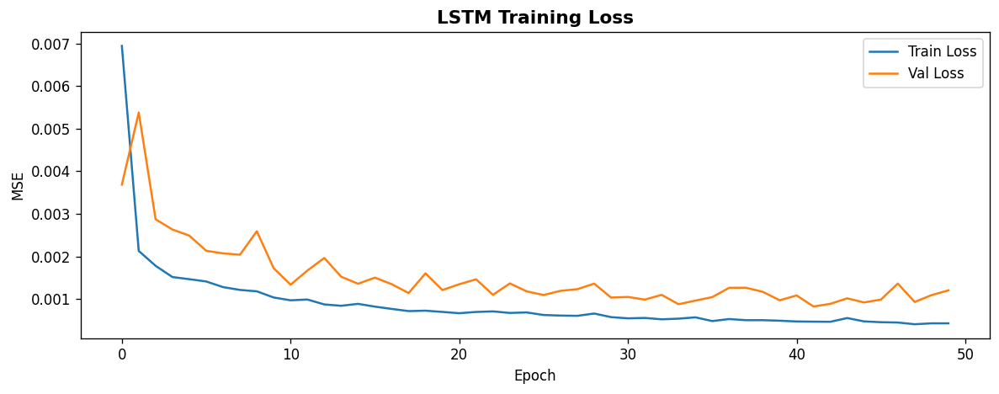

**LSTM Forecast**
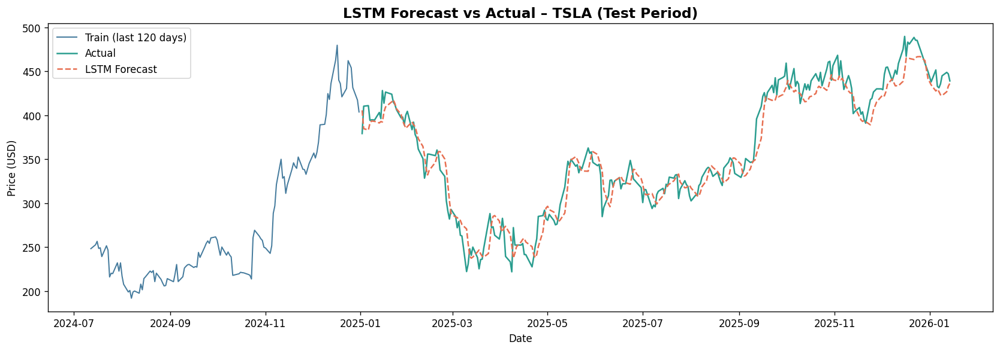

**Model Comparison**
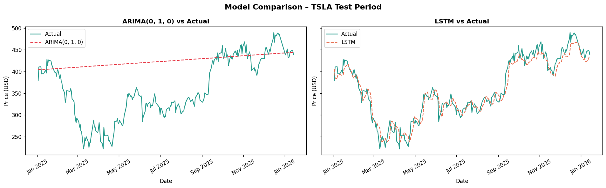

---

## Task 3 – Future Forecasts (6 & 12 Months)

Used the best model (LSTM) with Monte Carlo dropout (50 simulations) to generate forward price paths from Jan 2026.

| Horizon | Median Price | 5th pct | 95th pct | Expected Return |
|---------|-------------|---------|---------|-----------------|
| 6 months (Jul 2026) | $267.46 | $225.86 | $325.18 | −39.1 % |
| 12 months (Jan 2027) | $269.06 | $236.34 | $319.26 | −38.7 % |

> Last known price (Jan 2026): **$439.20**. The LSTM forecasts a significant mean-reversion / correction.

### Plots

**6-Month Forecast**
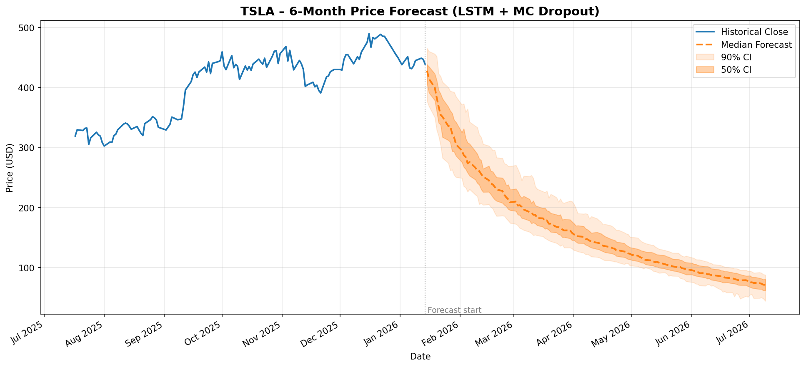

**12-Month Forecast**
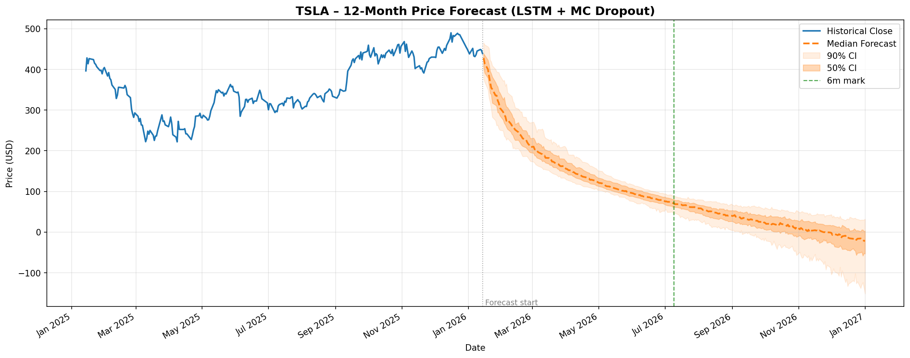

**Trend Analysis**
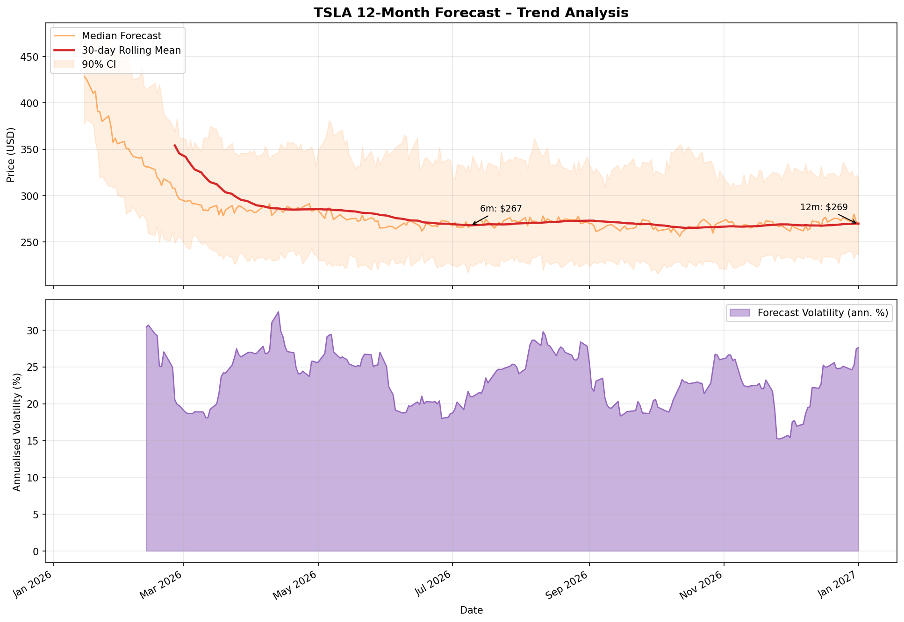

---

## Task 4 – Portfolio Optimisation (Efficient Frontier)

Used PyPortfolioOpt with expected returns from Task 3 LSTM forecasts (TSLA) and historical means (BND, SPY).

### Optimal Weights
| Portfolio | TSLA | BND | SPY | Expected Return | Volatility | Sharpe |
|-----------|------|-----|-----|-----------------|------------|--------|
| Max Sharpe | 0 % | 0 % | 100 % | 12.7 % | 17.9 % | 0.473 |
| Min Volatility | 0 % | 92.9 % | 7.1 % | 2.7 % | 5.7 % | −0.280 |

> TSLA's negative expected return (−38.7 %) from the LSTM forecast causes PyPortfolioOpt to allocate 0 % to TSLA in both portfolios.

### Plots

**Efficient Frontier**
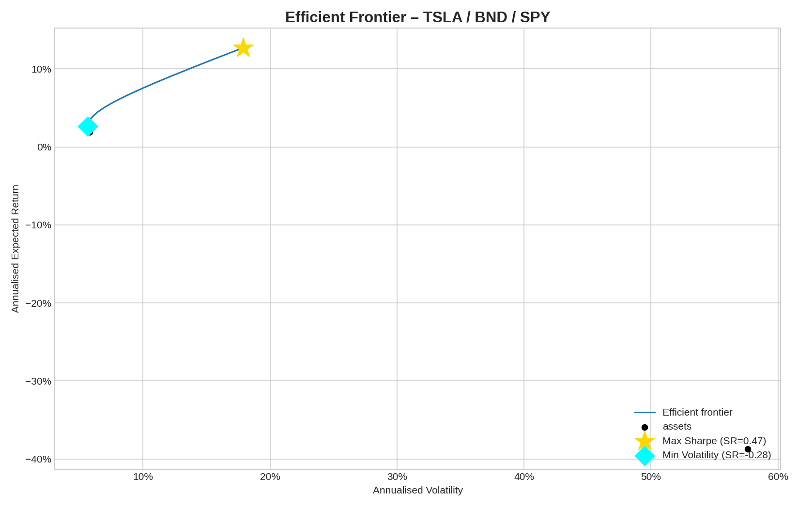

**Portfolio Weights**
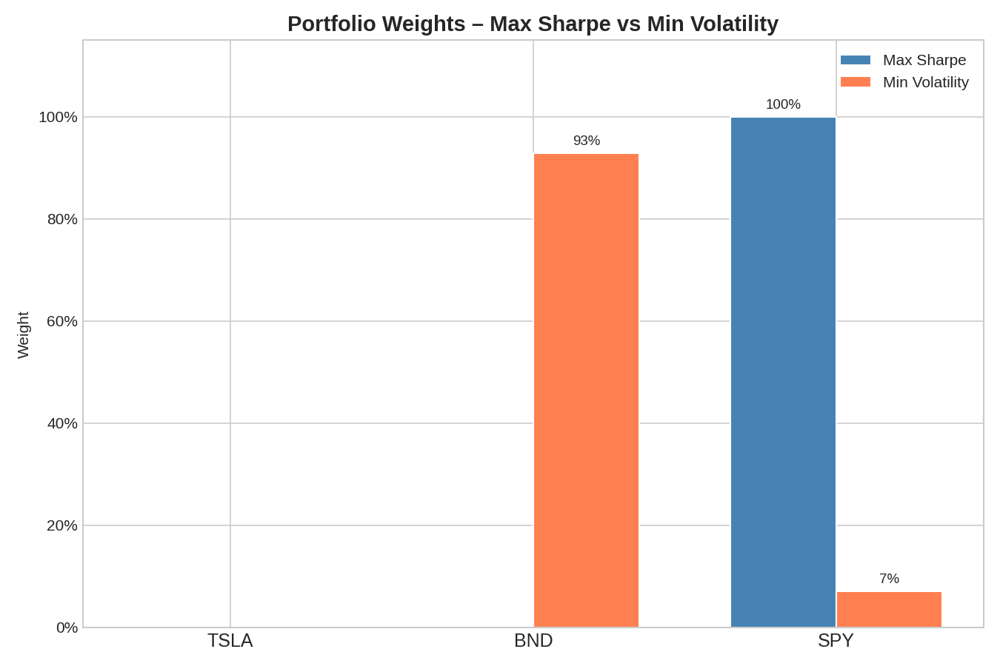

---

## Task 5 – Backtesting (Jan 2025 – Jan 2026)

Backtested the two portfolios from Task 4 against a classic **60 % SPY / 40 % BND** benchmark over the out-of-sample year.

### Performance Results
| Portfolio | Total Return | CAGR | Ann. Volatility | Sharpe Ratio | Max Drawdown |
|-----------|-------------|------|-----------------|--------------|--------------|
| Max Sharpe (100 % SPY) | +19.47 % | 18.98 % | 19.22 % | 0.778 | −18.76 % |
| Min Volatility (93 % BND) | +8.50 % | 8.29 % | 4.43 % | **0.862** | **−2.26 %** |
| Benchmark 60/40 | +15.07 % | 14.70 % | 11.82 % | 0.859 | −11.29 % |

### Key Takeaways
- **Max Sharpe** delivered the highest return (+19.5 %) but deepest drawdown (−18.8 %).
- **Min Volatility** achieved the best risk-adjusted return (Sharpe 0.862) with only −2.3 % max drawdown — ideal for capital-preservation mandates.
- **60/40 Benchmark** is a balanced middle ground: +15.1 % return, −11.3 % drawdown.

### Plots

**Cumulative Returns**
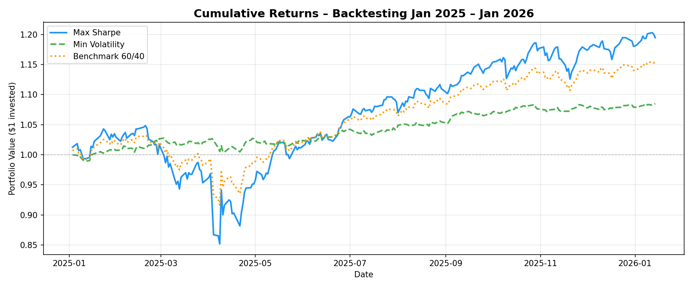

**Drawdown Curves**
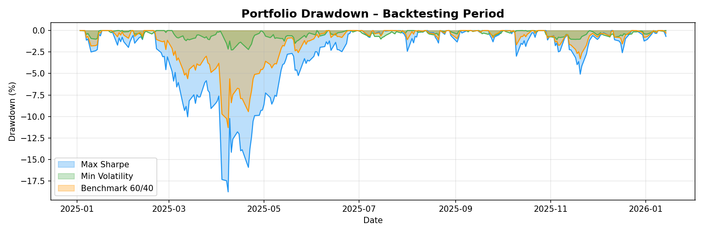

**Metrics Comparison**
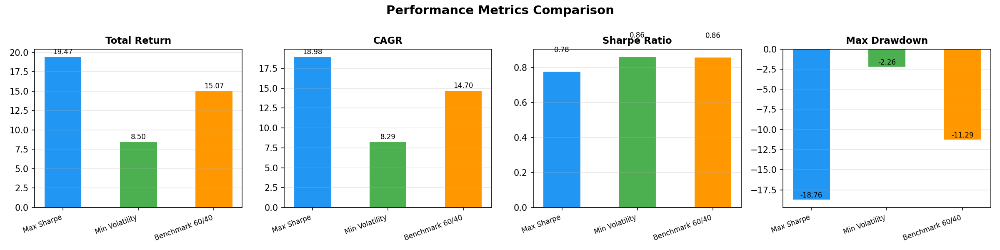

---

## Setup
```bash
pip install -r requirements.txt
jupyter notebook
```

## Running Tests
```bash
pytest tests/ -v
```
